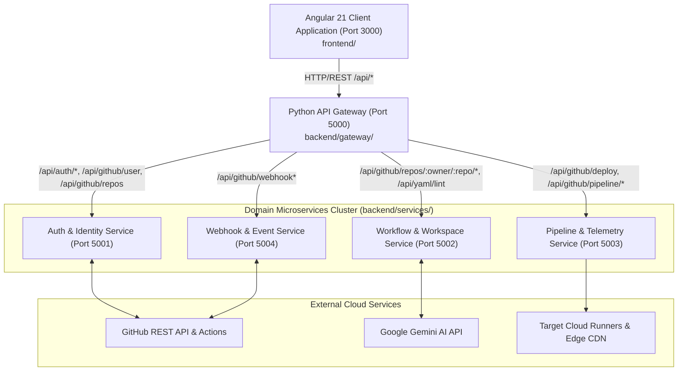

<div align="center">

# ShipPulse ⚡
### High-Velocity GitHub CI/CD & Real-Time DORA Telemetry Studio

[](.github/workflows/ci.yml)
[](https://fastapi.tiangolo.com/)
[](https://www.python.org/)
[](https://angular.dev/)
[](docker-compose.yml)
[](LICENSE)

<p align="center">
  <b>ShipPulse</b> is an enterprise-grade CI/CD automation hub powered by an asynchronous <b>Python Microservices Cluster (FastAPI)</b> and an <b>Angular 21 SSR Client</b>. It connects multiple GitHub accounts, generates battle-tested deployment workflows, validates supply chain security (SLSA Level 3), simulates pipeline executions with chaos engineering, and streams real-time DORA fleet telemetry.
</p>

</div>

---

## 📚 Documentation Hub

Explore our comprehensive enterprise documentation across all domains:

| Document | Description | Target Audience |
| :--- | :--- | :--- |
| **[Architecture & Domain Model](docs/architecture.md)** | System topology, domain boundaries, Pydantic contracts & Mermaid diagrams | Architects, Senior Engineers |
| **[API Reference](docs/api-reference.md)** | REST endpoints, OpenAPI schemas, and Gateway reverse-proxy mappings | Backend / Full-Stack Developers |
| **[Developer Setup Guide](docs/setup-guide.md)** | Local installation, environment configuration, and Docker Compose guide | All Contributors |
| **[Frontend Guide](frontend/README.md)** | Angular 21 SSR architecture, Signals, Tailwind CSS v4, and build scripts | Frontend Engineers |
| **[Backend Microservices Guide](backend/README.md)** | FastAPI services catalog, port mappings, and testing instructions | Backend / DevOps Engineers |
| **[Contributing Guidelines](CONTRIBUTING.md)** | Branching strategy, Conventional Commits, and Pull Request workflow | Open Source Contributors |
| **[Security Policy](SECURITY.md)** | Vulnerability reporting, HMAC webhook validation, and SLSA Level 3 security | Security & Compliance Teams |

---

## 🏛️ System Architecture

The repository is structured as an enterprise-grade polyglot monorepo cleanly isolating the Angular client, Python microservices, system documentation, and automation tooling:



---

## 📦 Microservices Catalog & Ports

| Service | Port | Responsibilities | Interactive Docs |
| :--- | :---: | :--- | :---: |
| **API Gateway** | `5000` | Unified reverse proxy, request routing, CORS, aggregated health checks (`/api/health`) | `http://localhost:5000/docs` |
| **Auth & Identity** | `5001` | GitHub OAuth 2.0 flow, CSRF state verification, token exchange, user profile & quota sync | `http://localhost:5001/docs` |
| **Workflow & Workspace** | `5002` | Virtual file manager, code hot-patching, AST-based YAML linting, workflow generator, Gemini AI | `http://localhost:5002/docs` |
| **Pipeline & Telemetry** | `5003` | Deployment automation, state machine (`Active`, `Paused`, `Cancelled`), live telemetry log streaming | `http://localhost:5003/docs` |
| **Webhook & Event** | `5004` | GitHub push event receiver, HMAC verification, mock push dispatcher, event audit history | `http://localhost:5004/docs` |

---

## 🚀 Quickstart

### Prerequisites
- **Python**: `3.11` or higher
- **Node.js**: `22.x` LTS or higher
- **Docker & Docker Compose** *(recommended for multi-container orchestration)*

### Option A: Run Full Stack with One Command (Native)

```bash
# 1. Install frontend dependencies
npm --prefix frontend install

# 2. Install backend dependencies
pip install -r backend/requirements.txt

# 3. Start Frontend (3000) & All Microservices (5000-5004) concurrently
python scripts/run-all.py
```
*Or via npm root script:* `npm run dev`

- **Web Application**: `http://localhost:3000`
- **API Gateway**: `http://localhost:5000`
- **Interactive Swagger Docs**: `http://localhost:5000/docs`

---

### Option B: Run with Docker Compose

Deploy the entire cluster in isolated Docker containers:

```bash
# Build and launch all services in detached mode
npm run docker:up

# View live service logs
npm run docker:logs

# Verify health status
curl http://localhost:5000/api/health

# Stop containers
npm run docker:down
```

---

## 🧪 Testing & Quality Assurance

Run the unified monorepo verification runner:
```bash
python scripts/verify-all.py
```

Or execute individual test suites:
```bash
# Full test suite (Frontend Vitest + Backend Pytest)
npm test

# Frontend ESLint verification (0 errors, 0 warnings required)
npm run lint

# Frontend strict TypeScript typecheck
npm run typecheck

# Backend Pytest test suite (24 unit tests)
pytest backend/tests -v

# Frontend production & SSR bundle build
npm run build
```

---

## 📁 Repository Structure

```
shippulse/
├── frontend/                  # Isolated Angular 21 Client Application
│   ├── src/                   # Angular source code (components, services, signals)
│   ├── public/                # Static assets & icons
│   ├── angular.json           # Angular CLI workspace config
│   ├── eslint.config.js       # Flat ESLint rules
│   ├── proxy.conf.json        # API Gateway proxy config
│   ├── tsconfig.json          # TypeScript compiler configuration
│   ├── Dockerfile             # Multi-stage production container
│   ├── package.json           # Frontend dependencies and npm scripts
│   └── README.md              # Frontend architecture & dev guide
│
├── backend/                   # Isolated Python Microservices Cluster
│   ├── gateway/               # FastAPI API Gateway (Port 5000)
│   ├── services/
│   │   ├── auth/              # Auth & Identity Microservice (Port 5001)
│   │   ├── workflow/          # Workflow & Generator Microservice (Port 5002)
│   │   ├── pipeline/          # Pipeline & Telemetry Microservice (Port 5003)
│   │   └── webhook/           # Webhook Ingestion Microservice (Port 5004)
│   ├── common/                # Shared Pydantic v2 domain schemas & config
│   ├── tests/                 # Pytest test suites (24 unit tests)
│   ├── requirements.txt       # Python dependencies
│   ├── run_microservices.py   # Microservices concurrency supervisor
│   └── README.md              # Microservices architecture & guide
│
├── docs/                      # Enterprise Architecture & Documentation
│   ├── architecture.md        # Monorepo topology and microservices flow
│   ├── api-reference.md       # API endpoints, request/response contracts
│   └── setup-guide.md         # Developer environment & Docker setup
│
├── scripts/                   # Developer & CI Automation Utilities
│   ├── run-all.py             # Master full-stack orchestrator (Frontend + Backend)
│   └── verify-all.py          # Unified test and build verification runner
│
├── .github/                   # CI/CD Workflows & Governance
│   ├── workflows/ci.yml       # GitHub Actions CI matrix
│   ├── ISSUE_TEMPLATE/        # Standardized issue templates
│   └── PULL_REQUEST_TEMPLATE.md
│
├── docker-compose.yml         # Container orchestration for all services
├── package.json               # Thin root orchestrator for repository scripts
├── CONTRIBUTING.md            # Contribution guidelines & branching model
├── SECURITY.md                # Security disclosure policy
├── LICENSE                    # MIT Open Source License
└── README.md                  # Project documentation hub
```

---

## 📄 License

This project is licensed under the **MIT License** - see the [LICENSE](LICENSE) file for details.