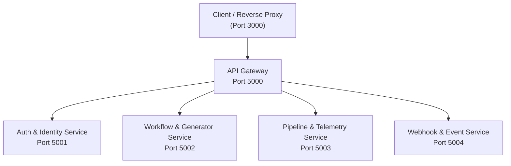

# ShipPulse - Python Microservices Cluster

The backend of ShipPulse is designed as an asynchronous, domain-driven microservice cluster built with **FastAPI**, **Uvicorn**, **Pydantic v2**, and **HTTPX**.

---

## 🏛️ Microservice Topology & Port Mapping



| Service | Directory | Port | Key Endpoints |
| :--- | :--- | :---: | :--- |
| **API Gateway** | `gateway/` | `5000` | `GET /api/health`, Ingress routing, CORS |
| **Auth Service** | `services/auth/` | `5001` | `GET /api/auth/login`, `GET /api/auth/callback`, `GET /api/auth/me` |
| **Workflow Service** | `services/workflow/` | `5002` | `POST /api/workflows/generate`, `POST /api/workflows/validate` |
| **Pipeline Service** | `services/pipeline/` | `5003` | `GET /api/pipelines`, `POST /api/pipelines/trigger` |
| **Webhook Service** | `services/webhook/` | `5004` | `POST /api/webhooks/github`, HMAC-SHA256 verification |

---

## 📁 Directory Structure

```
backend/
├── common/                  # Shared domain layer
│   ├── __init__.py
│   ├── config.py            # Central environment settings (Pydantic BaseSettings)
│   └── schemas.py           # Typed request/response models (Pydantic v2)
│
├── gateway/                 # Unified Reverse Proxy
│   ├── main.py              # FastAPI reverse proxy with async lifespan
│   ├── Dockerfile           # Gateway container definition
│   └── requirements.txt     # Service-specific requirements
│
├── services/                # Independent Domain Microservices
│   ├── auth/                # OAuth2 authentication & token exchange
│   ├── workflow/            # GitHub Actions generator & Gemini AI engine
│   ├── pipeline/            # Deployment runner & telemetry state machine
│   └── webhook/             # Cryptographic GitHub webhook validation
│
├── tests/                   # Pytest test suites (FastAPI TestClient)
│   ├── test_auth.py
│   ├── test_workflow.py
│   ├── test_pipeline.py
│   ├── test_webhook.py
│   └── test_gateway.py
│
├── requirements.txt         # Consolidated Python dependencies
└── run_microservices.py     # Local cluster concurrency supervisor
```

---

## 🚀 Running the Microservices

### 1. Install Dependencies
```bash
pip install -r backend/requirements.txt
```

### 2. Start Entire Cluster Concurrently
```bash
python backend/run_microservices.py
```
This launches the API Gateway and all 4 domain microservices with auto-restart and unified logging.

### 3. Start an Individual Service (Manual)
To run an individual service in isolation:
```bash
# Set PYTHONPATH so services can import the common package
export PYTHONPATH=.   # On Linux/macOS
$env:PYTHONPATH="."   # On Windows PowerShell

# Start Auth Service on port 5001 with hot reload:
uvicorn services.auth.main:app --host 0.0.0.0 --port 5001 --reload
```

---

## 🧪 Testing

Execute the comprehensive test suite with Pytest (24 unit tests covering auth, workflow generator, pipeline state machine, HMAC webhook verification, and gateway security headers):

```bash
# Run all microservice tests with verbose output (24 passed)
pytest backend/tests -v

# Run tests for a specific microservice
pytest backend/tests/test_webhook.py -v
pytest backend/tests/test_gateway.py -v
```

Interactive OpenAPI/Swagger documentation is available for each running service:
- API Gateway: `http://localhost:5000/docs`
- Auth Service: `http://localhost:5001/docs`
- Workflow Service: `http://localhost:5002/docs`
- Pipeline Service: `http://localhost:5003/docs`
- Webhook Service: `http://localhost:5004/docs`
