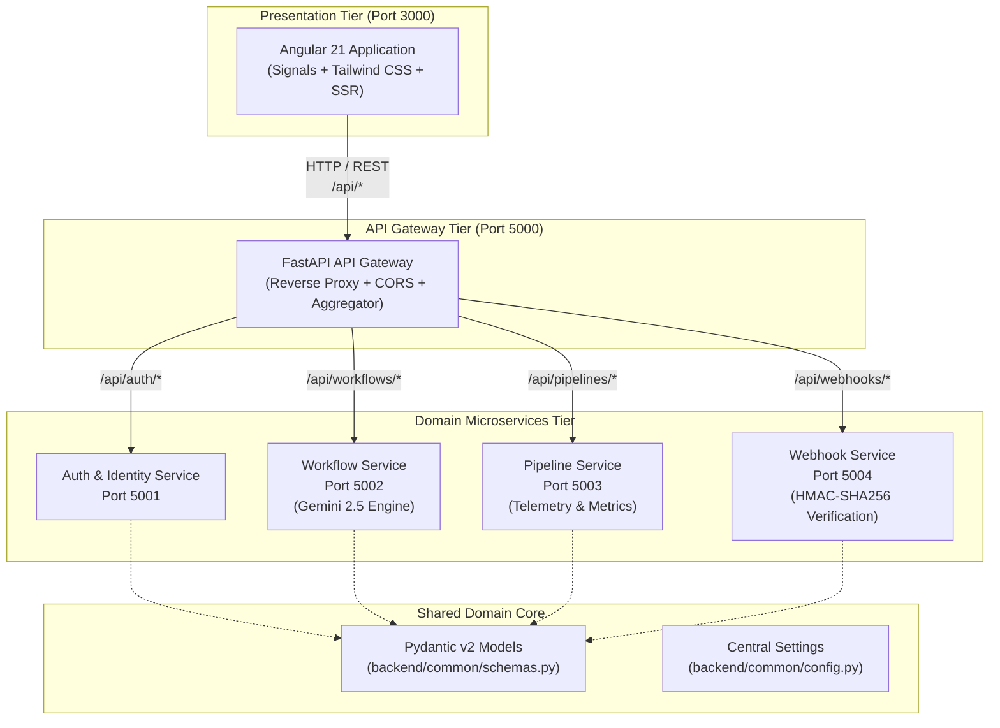

# ShipPulse - Architecture & Domain Model

ShipPulse is engineered as an enterprise-grade polyglot monorepo hosting an Angular 21 SSR client frontend alongside an asynchronous Python microservices backend cluster managed by FastAPI and Uvicorn.



---

## 1. Repository Layout Strategy

The repository follows a clean, decoupled layout with explicit domain isolation:

```
shippulse/
├── frontend/                  # Isolated Angular 21 SSR Client Application
│   ├── src/                   # Angular source code (components, services, signals)
│   ├── public/                # Static web assets
│   ├── angular.json           # Angular CLI workspace configuration
│   ├── package.json           # Frontend dependencies & npm scripts
│   ├── tsconfig.json          # TypeScript configurations
│   ├── eslint.config.js       # Modern flat ESLint configuration
│   └── Dockerfile             # Multi-stage production container build
│
├── backend/                   # Isolated Python Microservices Cluster
│   ├── gateway/               # Central FastAPI API Gateway (Port 5000)
│   ├── services/
│   │   ├── auth/              # OAuth2 & Session management (Port 5001)
│   │   ├── workflow/          # GitHub Actions Generator & Gemini AI (Port 5002)
│   │   ├── pipeline/          # Pipeline execution & telemetry (Port 5003)
│   │   └── webhook/           # Secure GitHub webhook processor (Port 5004)
│   ├── common/                # Shared Pydantic v2 domain schemas & config
│   ├── tests/                 # Comprehensive Pytest test suites
│   ├── requirements.txt       # Python dependencies
│   └── run_microservices.py   # Multi-service local supervisor
│
├── docs/                      # Enterprise Documentation
│   ├── architecture.md        # System architecture, topology, and flow diagrams
│   ├── api-reference.md       # API endpoints, request/response contracts
│   └── setup-guide.md         # Local developer environment and Docker setup
│
├── scripts/                   # Developer & CI Automation Utilities
│   ├── run-all.py             # Master full-stack runner (Frontend + Backend)
│   └── verify-all.py          # Unified test and build verification runner
│
├── .github/                   # CI/CD Workflows & Governance
│   ├── workflows/ci.yml       # GitHub Actions CI matrix
│   ├── ISSUE_TEMPLATE/        # Standardized issue templates
│   └── PULL_REQUEST_TEMPLATE.md
│
├── docker-compose.yml         # Container orchestration for all services
├── package.json               # Thin root orchestrator for repository scripts
└── README.md                  # Project overview & developer quickstart
```

---

## 2. Microservice Boundaries & Responsibilities

### 2.1 API Gateway (`backend/gateway/`) - Port 5000
- **Purpose**: Single unified reverse-proxy entry point for all frontend client traffic.
- **Responsibilities**:
  - Routes inbound `/api/*` traffic to the corresponding downstream microservice.
  - Aggregates system-wide health status via `/api/health`.
  - Enforces CORS policies, request timeouts, and error response formatting.

### 2.2 Auth Service (`backend/services/auth/`) - Port 5001
- **Purpose**: Identity, GitHub OAuth2 authentication, and session management.
- **Responsibilities**:
  - Handles GitHub OAuth authorization redirects and token exchange.
  - Generates secure session cookies or JWT tokens.
  - Validates active user tokens.

### 2.3 Workflow Service (`backend/services/workflow/`) - Port 5002
- **Purpose**: Workflow generation, multi-account configuration, and Gemini AI integration.
- **Responsibilities**:
  - Generates clean GitHub Actions YAML configurations based on user specifications.
  - Integrates with Google Gemini (`@google/genai` / `google-genai`) for AI-powered optimization of workflows.
  - Validates generated YAML syntax.

### 2.4 Pipeline Service (`backend/services/pipeline/`) - Port 5003
- **Purpose**: Pipeline telemetry, execution metrics, and deployment history.
- **Responsibilities**:
  - Tracks deployment run status, duration, and success/failure rates.
  - Provides aggregated cluster telemetry for dashboard widgets.
  - Manages run cancellation and retry queues.

### 2.5 Webhook Service (`backend/services/webhook/`) - Port 5004
- **Purpose**: Ingestion and cryptographic validation of GitHub webhooks.
- **Responsibilities**:
  - Verifies inbound `X-Hub-Signature-256` headers using HMAC-SHA256 and configured webhook secret.
  - Ingests `push`, `pull_request`, and `workflow_run` events.
  - Emits internal pipeline update events.

---

## 3. Shared Domain Models (`backend/common/`)

All microservices adhere to strict, typed contracts defined using **Pydantic v2**:
- `WorkflowGenerateRequest` & `WorkflowGenerateResponse`: Payload structure for workflow generation.
- `PipelineRun`: Standard model representing pipeline executions and statuses.
- `WebhookPayload`: Envelope for verified webhook payloads.
- `HealthResponse`: Standardized health status response across all services.
